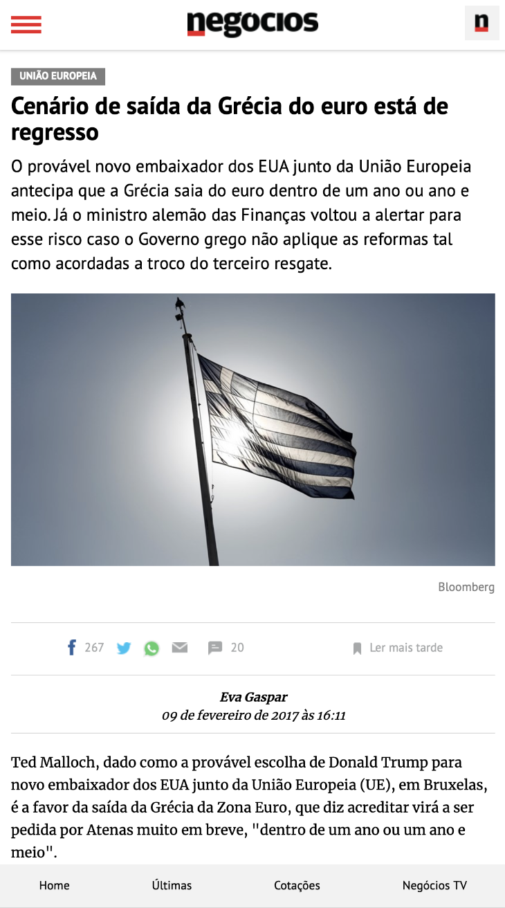
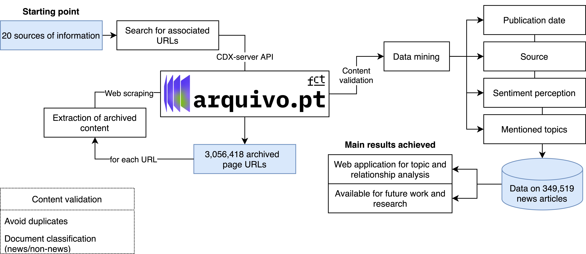
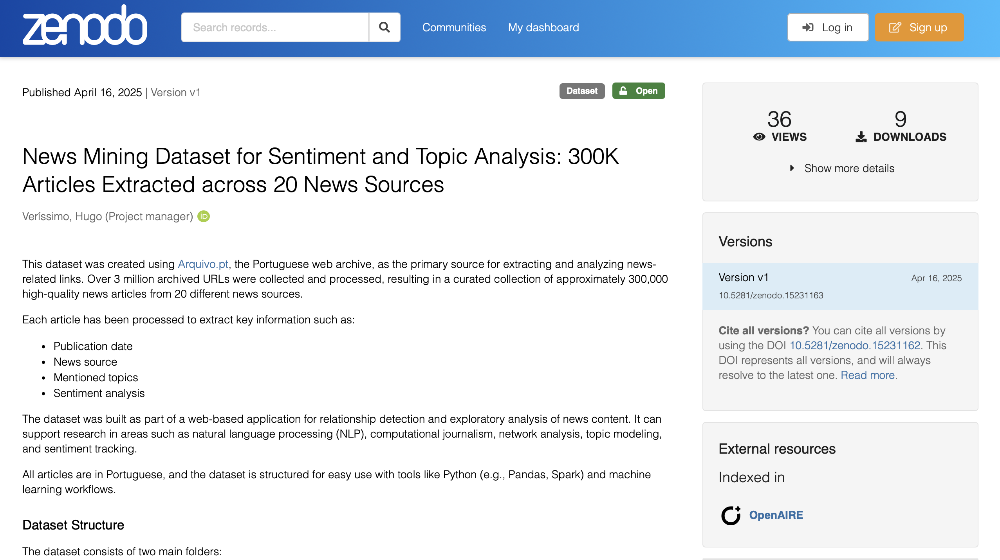
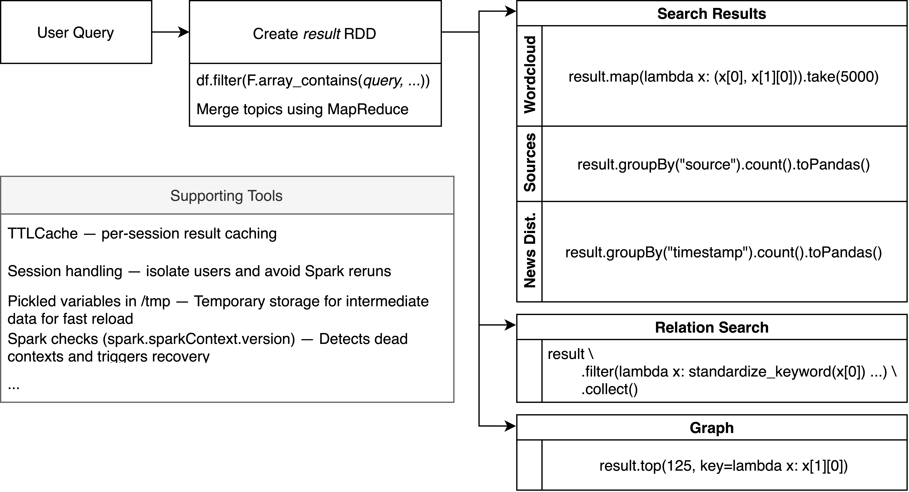

```{r setup, include = FALSE}
# packages
library(dplyr)
library(knitr)
library(xtable)
library(reticulate)
```

## NOTAS

meter justify

meter footer com o link para pasta ou ficheiro

rever esteticas todas, n estou a ligar a isso agora, so conteudo

## Lupa Digital {.justify}

Lupa Digital is an initiative that applies AI and data mining to large-scale journalistic content, exploring the evolving news landscape through the lens of metajournalism.

- Identify and classify news articles across a wide range of domains.

- Extract relevant information and preprocess data to support analysis.

- Detect trends and reveal patterns across topics, sources, and time periods.

> Transform large volumes of archived news into structured, analyzable datasets, enabling a deeper understanding of entities, events and themes.

# Data Pipeline <br>& Methodology

## News URL Harvesting {.justify}

```{=html}
<figure style="text-align: center;">
    
</figure>
```

## Example: API Result {.justify}

From a source such as [www.rtp.pt](https://www.rtp.pt), retrieve archived news urls:

```{txt}
timestamp,url
20180322091927,https://www.rtp.pt/noticias/cultura/viseu-veste-fachadas-de-igrejas-com-desenhos-de-luz-para-celebrar-a-pascoa_n1065023
20220412001133,https://www.rtp.pt/noticias/cultura/visita-guiada-conta-historias-para-alem-do-que-muita-gente-sabe-em-coimbra_n1397856
20150724061305,http://www.rtp.pt/noticias/cultura/visita-guiada-pelas-obras-de-rui-sanches_v846013
20150827180844,http://www.rtp.pt/noticias/cultura/visitantes-da-festa-do-avante-vao-ser-recebidos-com-musica-de-orquestra-sinfonica_a854349
20190710182452,https://www.rtp.pt/noticias/cultura/visitantes-do-museu-dos-coches-sao-estrangeiros-com-mais-de-40-anos_n1159600
20200914194159,https://www.rtp.pt/noticias/cultura/visitantes-do-museu-e-parque-arqueologico-do-coa-duplicaram-em-agosto-deste-ano_n1258927
20200421030337,https://www.rtp.pt/noticias/cultura/visitar-museus-sem-sair-de-casa-em-dias-de-pandemia_v1221917
20150812054702,http://www.rtp.pt/noticias/cultura/visitas-a-monumentos-museus-e-palacios-rendem-cerca-de-um-milhao-de-euros_v850595
20160416215125,http://www.rtp.pt/noticias/cultura/visitas-as-galerias-romanas-ja-estao-esgotadas_v911728
20170327181559,https://www.rtp.pt/noticias/cultura/visitas-gratuitas-ao-teatro-nacional-sao-joao_v991499
20151007081054,http://www.rtp.pt/noticias/cultura/visitas-guiadas-aos-pacos-do-concelho-contam-novas-historias-da-lisboa-antiga_v863875
20190831185917,http://www.rtp.pt/noticias/cultura/visitas-guiadas-e-gratuitas-no-coliseu-do-porto_v970454
20200607225302,https://www.rtp.pt/noticias/cultura/visitas-guiadas-encenadas-regressam-a-aldeia-historica-de-castelo-rodrigo_n1234927
20220926183818,https://www.rtp.pt/noticias/cultura/visitas-virtuais-revelam-espacos-emblematicos-da-universidade-de-coimbra_n1435642
20170308191800,https://www.rtp.pt/noticias/cultura/visoes-de-alhambra-em-exposicao-no-museu-de-serralves_v987510
20190831185922,http://www.rtp.pt/noticias/cultura/visoes-de-julio-pomar-e-vitor-pomar-numa-exposicao-conjunta-em-lisboa_n930053
20190906021344,http://www.rtp.pt/noticias/cultura/visoes-de-julio-pomar-e-vitor-pomar-numa-exposicao-conjunta-em-lisboa_n930053
20191201214933,https://www.rtp.pt/noticias/cultura/vitalina-varela-de-pedro-costa-vence-premio-dos-caminhos-do-cinema-portugues_a1189245
20210129200211,https://www.rtp.pt/noticias/cultura/vitalina-varela-e-o-filme-portugues-na-corrida-aos-oscares_v1293573
20171114075240,https://www.rtp.pt/noticias/cultura/vitimas-de-assedio-tem-momento-muito-poderoso-para-dizer-basta-diz-atriz-rosario-dawson_n1039262
20171206095156,https://www.rtp.pt/noticias/cultura/ze-pedro-marcelo-quer-homenagem-inesquecivel-e-com-muito-publico_v1043993
20180721172036,https://www.rtp.pt/noticias/cultura/ze-pedro-recordado-com-espetaculo-de-coisas-bonitas_n1088575
20200805235517,https://www.rtp.pt/noticias/cultura/ze-pedro-rock-n-roll-documentario-sobre-guitarrista-dos-xutos-pontapes_a1248556
20200731182132,https://www.rtp.pt/noticias/cultura/ze-pedro-rock-n-roll-ja-esta-nos-cinemas_v1248844
20200806052707,https://www.rtp.pt/noticias/cultura/ze-pedro-rock-n-roll-realizador-diogo-varela-silva-falou-com-a-antena-1_a1248691
20201123234614,https://www.rtp.pt/noticias/cultura/ze-pedro-rock-nroll-vence-premio-de-melhor-longa-metragem-em-festival-nos-eua_n1277663
20171204002422,http://www.rtp.pt/noticias/cultura/ze-pedro-subiu-pela-ultima-vez-ao-palco-ha-menos-de-um-mes_v1043773
20170223040812,https://www.rtp.pt/noticias/cultura/zeca-afonso-companheiros-confessam-saudade-de-um-homem-generoso-e-valente_n984331
20170227001126,http://www.rtp.pt/noticias/cultura/zeca-afonso-e-as-palavras-que-quanto-mais-se-apartam-mais-se-ouve-o-seu-grito_v984949
20170227001310,http://www.rtp.pt/noticias/cultura/zeca-afonso-morreu-ha-30-anos_v984929
20240324193757,https://www.rtp.pt/noticias/cultura/zeca-afonso-o-esquerdista-apupado-em-grandola-que-ia-a-festa-do-avante_n984329
20240324193653,https://www.rtp.pt/noticias/cultura/zeca-afonso-um-artista-que-deixou-sementes-para-as-geracoes-seguintes_n984328
20170223040839,https://www.rtp.pt/noticias/cultura/zeca-afonso-um-mar-de-gente-e-de-cravos-vermelhos-marcou-funeral-ha-30-anos_n984332
20180516054359,https://www.rtp.pt/noticias/cultura/zonas-de-interesse-turistico-de-castelo-branco-cobertas-com-rede-wi-fi-gratuita_n1075883
20200413183202,https://www.rtp.pt/noticias/cultura/zoo-de-lourosa-continua-a-alimentar-500-aves-e-a-manter-80-habitats-sem-bilheteira_n1219867
```

## Data Extraction and Mining {.justify}

```{=html}
<figure style="text-align: center;">
    
</figure>
```

In order to make the process more robust and efficient...

## Data Extraction and Mining {.justify}

the news were processed in chuncks of 10000 and checkpoints were saved??

there chucks were processed:

- using `PySpark` to leverage parellism?

- usnig `BeautifulSoup` for web scrapping

- using `BloomFilter` to avoid duplicated news

- using a ML Model for document classification

- using `TextBlob` and `Vader` for sentiment analysis

- using `spacy` for lemmatization/tokenization and NER for topic extraction

- using probabilistic counters for topic counting

## Example: Web Scraping {.justify}

:::: {.columns}
::: {.column width="35%"}
```{=html}
<figure style="text-align: center;">
  <a href="https://arquivo.pt/noFrame/replay/20171223212100/http://www.jornaldenegocios.pt/economia/europa/uniao-europeia/detalhe/grecia-fora-do-euro-em-breve-diz-proximo-de-trump-e-uma-possibilidade-repete-schuble"
     title="https://arquivo.pt/noFrame/replay/20171223212100/http://www.jornaldenegocios.pt/economia/europa/uniao-europeia/detalhe/grecia-fora-do-euro-em-breve-diz-proximo-de-trump-e-uma-possibilidade-repete-schuble"
     target="_blank">
    
  </a>
</figure>
```
:::

::: {.column width="65%"}
Cenário de saída da Grécia do euro está de regresso - União Europeia - Jornal de Negócios Cotações Mercados Análise Fundamental Técnica Portfolio Gestor Accões Favoritas Estatísticas Taxas de Juro Câmbios Subscrever assinar Login Registe-se \\xa0Cenário de saída da Grécia do euro está de regresso União Europeia Cenário de saída da Grécia do euro está de regresso O provável novo embaixador dos EUA junto da União Europeia antecipa que a Grécia saia do euro dentro de um ano ou ano e meio. Já o ministro alemão das Finanças voltou a alertar para esse risco caso o Governo grego não aplique as reformas tal como acordadas a troco do terceiro resgate...
:::
::::

## Example: Data Mining {.justify}

validate it (its is news and not repeated)

get insights:

publication date: 201712

"source":"Jornal de Negócios"

sentiment perception: 0.6086897

mentioned topics:"crise":4,"governo":16,"refugiado":4,"período":2,"implementar":2,"êxito":2,"resgate":12,"Atenas":9,"estatuto":2,"a Grécia":13,"Grécia":18,"Mecanismo Europeu de Estabilidade":2,"líder":4,"Moody":1,"Comissão Europeia":2,"Saír":1,"Primeira Página":1,...

## Topic Standardization {.justify}

```{python, echo=FALSE}
print("""Number of unique topics:  1457234
+-------------------------+
|value                    |
+-------------------------+
|P2 Ípsilon Ímpar Fugas P3|
|laboratório              |
|galp                     |
|Galp                     |
|O Banco de Portugal      |
|Saúde   Covid-19   COVID |
+-------------------------+""")
```

Problems:

- different forms of writting (lower or uppercase)

- multiple topics per "topic"

- artigos definidos a preceder o nome

## Topic Standardization {.justify}

Idea: Map "topic" to a list corresponding to it

```{.python code-line-numbers="1-5|8-23|26-39|42-58|61-64"}
# split topics with more then 2 spaces
df = df.withColumn(
  "tokens",
  F.split(F.col("value"), " {2,}")
)


# standartize topics using mapping
# either using a portuguese dictionary (Natura Dictionary)
dicitionary = spark.read.text("wordlist_utf8.txt")
...
word_map_broadcast = spark.sparkContext.broadcast(word_map)

# or the most common representation ("galp" VS "Galp")
tokens_df = tokens_df \
            .withColumn("std_token", F.lower(F.col("token"))) \
            .groupBy("std_token", "token") \
            .agg(F.count("*").alias("count")) \
            .withColumn("rank", F.row_number().over(window_spec)) \
            .filter(F.col("rank") == 1) \
            .orderBy("std_token") \
            .select("std_token", "token", "count")
...
       
            
# split topics into possible subtopics
def split_topics(token):
  """
  ex.:
    Banco de Portugal -> banco, Portugal, Banco de Portugal
    Leonor Pereira -> Leonor Pereira
    laboratório -> laboratório
    EDP Gás -> EDP, gás, EDP Gás
  """
  ...

df = df.rdd.flatMap(
    lambda row: [[row[0], split_topics(row[1])]]) \
    .toDF(["topic", "token"]
    
    
# remove invalid topics using regex
def date_detection(token):
    months = bool(re.search(r"\b(?:Jan|Fev|Abr|Mai|Jun|Jul|Ago|Set|Out|Nov|Dez)\b", token))
    march = bool(re.search(r"\b(?:\d{1,2} Mar|Mar \d{2,4})\b", token))
    months2 = bool(re.search(r"^(janeiro|fevereiro|março|abril|maio|junho|julho|agosto|setembro|outubro|novembro|dezembro)\b", token, flags=re.IGNORECASE))
    dateD = bool(re.search(r"\b(Janeiro|Fevereiro|Março|Abril|Maio|Junho|Julho|Agosto|Setembro|Outubro|Novembro|Dezembro)[ ]?\d{2,4}\b", token, flags=re.IGNORECASE))
    dateY = bool(re.search(r"\b\d{1,2}(?:\s+de)?\s+(janeiro|fevereiro|março|abril|maio|junho|julho|agosto|setembro|outubro|novembro|dezembro)\b", token, flags=re.IGNORECASE))
    days = bool(re.search(r"\b(segunda-feira|terça-feira|quarta-feira|quinta-feira|sexta-feira|sábado|domingo)\b", token, flags=re.IGNORECASE))
    hours = bool(re.search(r"\b\d{1,2}:\d{2}\b", token)) or bool(re.search(r"\b\d{1,2}h\d{2}\b", token))
    minutes = bool(re.search(r"\b\d{1,2}m\d{2}\b", token))
    return months or march or months2 or dateD or dateY or days or hours or minutes
    
def invalid_tokens_detection(token):
    return date_detection(token) or ...

df = df.rdd.flatMap(
    lambda row: [(row[0], [token for token in row[1] if not invalid_tokens_detection(token)])])
  
    
# among other transformations
# ex.: duplicates, invalid characters, ...

df.write.mode("overwrite").json("topics.json")
```


## Topic Standardization {.justify}

```{python, echo=FALSE}
print("""+-------------------------+--------------------------------------------------+
|token                    |topic                                             |
+-------------------------+--------------------------------------------------+
|laboratório              |[laboratório]                                     |
|galp                     |[Galp]                                            |
|Galp                     |[Galp]                                            |
|O Banco de Portugal      |[banco, Portugal, Banco de Portugal]              |
|Saúde   Covid-19   COVID |[Saúde, Covid-19, Covid, Saúde   Covid-19   COVID]|
|José Mourinho            |[José Mourinho]                                   |
|11 de janeiro            |[]                                                |\n""")
```

$\ $

Problems:

```{python, echo=FALSE}
print("""|António Costa            |[António, costa, António Costa]                   |
|CHEGA                    |[chega]                                           |
|25 de abril              |[]                                                |
|Revolução de 25 de abril |[Revolução, Revolução de 25 de abril]             |
+-------------------------+--------------------------------------------------+""")
```

## Data Post-processing {.justify}

- Make sure there were no duplicated links

- Corrected news distrubtion to be more "normal"

- Map the new topics to replace the old ones

```{=html}
<figure style="text-align: center;">
    
</figure>
```

## Data Post-processing {.justify}

also created a column of token list, lemmatized (no accents, no upper, nothing) and significant (more then ex.: >5 mentions in the new) for easy search later on

```{python, echo=FALSE}
print("""root
 |-- timestamp: integer (nullable = true)
 |-- source: string (nullable = true)
 |-- archive: string (nullable = true)
 |-- id: integer (nullable = true)
 |-- probability: float (nullable = true)
 |-- keywords: map (nullable = true)
 |    |-- key: string
 |    |-- value: integer (valueContainsNull = true)
 |-- sentiment: double (nullable = true)
 |-- significant_keywords: array (nullable = true)
 |    |-- element: string (containsNull = true)
 """)
```

```{.python}
df.repartition(8).write.mode("overwrite").parquet("data/news_processed")
```

# Results

## Main Results {.justify}

```{=html}
<figure style="text-align: center;">
    
</figure>
```

## Dataset {.justify}

```{=html}
<figure style="text-align: center;">
    
</figure>
```

::: {style="text-align: center;"}
available at [10.5281/zenodo.15231163](https://doi.org/10.5281/zenodo.15231163)
:::

## Web Application

```{=html}
<figure style="text-align: center;">
    
</figure>
```

::: {style="text-align: center;"}
available at [lupa-digital.pt](https://lupa-digital.pt)
:::


## Web Application - Workflow

```{=html}
<figure style="text-align: center;">
    
</figure>
```


