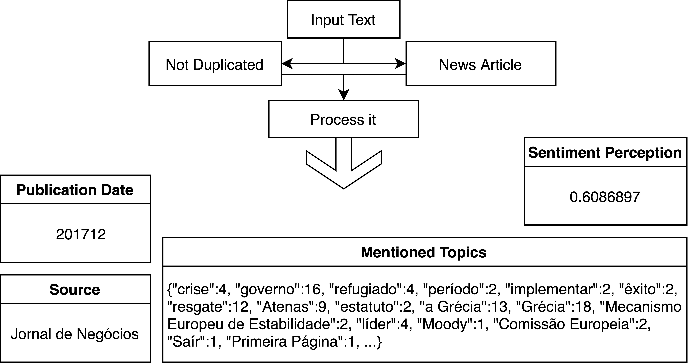

```{r setup, include = FALSE}
# packages
library(dplyr)
library(knitr)
library(xtable)
library(reticulate)
```

## Lupa Digital {.justify}

Lupa Digital is an initiative that applies AI and data mining to large-scale journalistic content, exploring the evolving news landscape through the lens of metajournalism.

- Identify and classify news articles across a wide range of domains.

- Extract relevant information and preprocess data to support analysis.

- Detect trends and reveal patterns across topics, sources, and time periods.

> Transform large volumes of archived news into structured, analyzable datasets, enabling a deeper understanding of entities, events and themes.

# Data Pipeline <br>& Methodology

## News URL Harvesting {.justify}

```{=html}
<figure style="text-align: center;">
    
</figure>
```

```{=html}
<div class="footer">
  github.com/LupaDigital25/data-extraction/blob/main/newsUrls.ipynb
</div>
```

## Example: API Request {.justify}

Sample query:

```plaintext
https://arquivo.pt/wayback/cdx \
?url=www.rtp.pt/noticias/cultura* \
&output=json \
&filter==mime:text/html \
&fields=url,timestamp
```

Sample output:

```plaintext
{"url": "https://www.rtp.pt/noticias/cultura/noticias/cultura/artigos/companhia-nacional-abre-temporada-com-obra-inspirada-na-opera-de-henry-purcell_1033406", "timestamp": "20171016065533"}
{"url": "http://www.rtp.pt/noticias/cultura/noticias/cultura/artigos/companhia-nacional-de-bailado-abre-temporada-com-peca-pedro-e-ines_865965", "timestamp": "20151014181241"}
{"url": "http://www.rtp.pt/noticias/cultura/noticias/cultura/artigos/companhia-nacional-de-bailado-apresenta-quatro-pecas-de-coreografos-do-seculo-xx_893880", "timestamp": "20160206045955"}
{"url": "https://www.rtp.pt/noticias/cultura/noticias/cultura/artigos/companhia-nacional-de-bailado-danca-com-akram-khan_982957", "timestamp": "20170214215117"}
{"url": "https://www.rtp.pt/noticias/cultura/noticias/cultura/artigos/companhia-nacional-de-bailado-estreia-nova-peca-de-olga-roriz-para-celebrar-saramago_1407664","timestamp": "20160229051915"}
{"url": "https://www.rtp.pt/noticias/cultura/noticias/cultura/artigos/competicao-internacional-de-danca-genee-da-royal-academy-pela-primeira-vez-em-portugal_1008253", "timestamp": "20170617061712"}
{"url": "https://www.rtp.pt/noticias/cultura/noticias/cultura/artigos/composicao-a-toa-de-miguel-bastos-vence-concurso-internacional-da-povoa-de-varzim_1015347", "timestamp": "20170717231439"}
{"url": "https://www.rtp.pt/noticias/cultura/noticias/cultura/artigos/compositor-joao-pedro-coimbra-apresenta-projeto-vibra-e-o-seu-album-de-estreia-em-junho_1201778", "timestamp": "20200130212156"}
{"url": "http://www.rtp.pt/noticias/cultura/noticias/cultura/artigos/comunidade-chinesa-ja-festeja-o-ano-do-macaco_892519", "timestamp": "20160202050114"}
```

```{=html}
<div class="footer">
  github.com/LupaDigital25/data-extraction/blob/main/newsUrls.ipynb
</div>
```

## Data Extraction and Mining {.justify}

```{=html}
<figure style="text-align: center;">
    
</figure>
```

To support this pipeline, a combination of tools and techniques was used…

```{=html}
<div class="footer">
  github.com/LupaDigital25/data-extraction/blob/main/dataExtraction.py
</div>
```

## Data Extraction and Mining {.justify}

Archived news pages were processed in chunks of 10,000, with checkpoints saved for fault tolerance and resumability. Used:

- `PySpark` for parallelized processing across large datasets  

- `BeautifulSoup` for HTML parsing and web scraping  

- `BloomFilter` to efficiently detect and skip duplicate articles  

- ML model to classify documents as news or non-news 

- `TextBlob` and `VADER` for sentiment analysis 

- `spaCy` for lemmatization, tokenization, and NER for topic extraction

- Probabilistic counters for scalable topic frequency estimation

```{=html}
<div class="footer">
  github.com/LupaDigital25/data-extraction/blob/main/dataExtraction.py
</div>
```

## Example: Web Scraping {.justify}

:::: {.columns}
::: {.column width="33%"}
```{=html}
<figure style="text-align: center;">
  <a href="https://arquivo.pt/noFrame/replay/20171223212100/http://www.jornaldenegocios.pt/economia/europa/uniao-europeia/detalhe/grecia-fora-do-euro-em-breve-diz-proximo-de-trump-e-uma-possibilidade-repete-schuble"
     title="https://arquivo.pt/noFrame/replay/20171223212100/http://www.jornaldenegocios.pt/economia/europa/uniao-europeia/detalhe/grecia-fora-do-euro-em-breve-diz-proximo-de-trump-e-uma-possibilidade-repete-schuble"
     target="_blank">
    
  </a>
</figure>
```
:::

::: {.column width="67%"}
Cenário de saída da Grécia do euro está de regresso - União Europeia - Jornal de Negócios Cotações Mercados Análise Fundamental Técnica Portfolio Gestor Accões Favoritas Estatísticas Taxas de Juro Câmbios Subscrever assinar Login Registe-se \\xa0Cenário de saída da Grécia do euro está de regresso União Europeia Cenário de saída da Grécia do euro está de regresso O provável novo embaixador dos EUA junto da União Europeia antecipa que a Grécia saia do euro dentro de um ano ou ano e meio. Já o ministro alemão das Finanças voltou a alertar para esse risco caso o Governo grego não aplique as reformas tal como acordadas a...
:::
::::

```{=html}
<div class="footer">
  github.com/LupaDigital25/data-extraction/blob/main/dataExtraction.py
</div>
```

## Example: Data Mining {.justify}

```{=html}
<figure style="text-align: center;">
    
</figure>
```

```{=html}
<div class="footer">
  github.com/LupaDigital25/data-extraction/blob/main/dataExtraction.py
</div>
```

## Topic Standardization {.justify}

```{python, echo=FALSE}
print("""Number of unique topics:  1457234
+-------------------------+
|value                    |
+-------------------------+
|P2 Ípsilon Ímpar Fugas P3|
|laboratório              |
|galp                     |
|Galp                     |
|O Banco de Portugal      |
|Saúde   Covid-19         |
+-------------------------+""")
```

Problems:

- Inconsistent casing (`galp` vs `Galp`)

- Leading definite articles (`O Banco de Portugal`)

- Multiple concepts grouped into a single topic (`Saúde   Covid-19`)

```{=html}
<div class="footer">
  github.com/LupaDigital25/data-preprocessing/blob/main/dataPrep%20topicEDA.ipynb
</div>
```

## Topic Standardization {.justify}

Idea: Map each topic to a list of terms for normalization

```{.python code-line-numbers="1-5|8-23|26-39|42-58|61-64"}
# split topics with more than 2 spaces
df = df.withColumn(
  "tokens",
  F.split(F.col("value"), " {2,}")
)


# standardize topics using mapping
# either using a portuguese dictionary (Natura Dictionary)
dicitionary = spark.read.text("wordlist_utf8.txt")
...
word_map_broadcast = spark.sparkContext.broadcast(word_map)

# or the most common representation ("galp" VS "Galp")
tokens_df = tokens_df \
            .withColumn("std_token", F.lower(F.col("token"))) \
            .groupBy("std_token", "token") \
            .agg(F.count("*").alias("count")) \
            .withColumn("rank", F.row_number().over(window_spec)) \
            .filter(F.col("rank") == 1) \
            .orderBy("std_token") \
            .select("std_token", "token", "count")
...
       
            
# split topics into possible subtopics
def split_topics(token):
  """
  ex.:
    Banco de Portugal -> banco, Portugal, Banco de Portugal
    Leonor Pereira -> Leonor Pereira
    laboratório -> laboratório
    EDP Gás -> EDP, gás, EDP Gás
  """
  ...

df = df.rdd.flatMap(
    lambda row: [[row[0], split_topics(row[1])]]) \
    .toDF(["topic", "token"])
    
    
# remove invalid topics using regex
def date_detection(token):
    months = bool(re.search(r"\b(?:Jan|Fev|Abr|Mai|Jun|Jul|Ago|Set|Out|Nov|Dez)\b", token))
    march = bool(re.search(r"\b(?:\d{1,2} Mar|Mar \d{2,4})\b", token))
    months2 = bool(re.search(r"^(janeiro|fevereiro|março|abril|maio|junho|julho|agosto|setembro|outubro|novembro|dezembro)\b", token, flags=re.IGNORECASE))
    dateD = bool(re.search(r"\b(Janeiro|Fevereiro|Março|Abril|Maio|Junho|Julho|Agosto|Setembro|Outubro|Novembro|Dezembro)[ ]?\d{2,4}\b", token, flags=re.IGNORECASE))
    dateY = bool(re.search(r"\b\d{1,2}(?:\s+de)?\s+(janeiro|fevereiro|março|abril|maio|junho|julho|agosto|setembro|outubro|novembro|dezembro)\b", token, flags=re.IGNORECASE))
    days = bool(re.search(r"\b(segunda-feira|terça-feira|quarta-feira|quinta-feira|sexta-feira|sábado|domingo)\b", token, flags=re.IGNORECASE))
    hours = bool(re.search(r"\b\d{1,2}:\d{2}\b", token)) or bool(re.search(r"\b\d{1,2}h\d{2}\b", token))
    minutes = bool(re.search(r"\b\d{1,2}m\d{2}\b", token))
    return months or march or months2 or dateD or dateY or days or hours or minutes
    
def invalid_tokens_detection(token):
    return date_detection(token) or ...

df = df.rdd.flatMap(
    lambda row: [(row[0], [token for token in row[1] if not invalid_tokens_detection(token)])])
  
    
# among other transformations
# e.g.: invalid characters, ...

df.write.mode("overwrite").json("topics.json")
```

```{=html}
<div class="footer">
  github.com/LupaDigital25/data-preprocessing/blob/main/dataPrep%20topicPrep.ipynb
</div>
```


## Topic Standardization {.justify}

```{python, echo=FALSE}
print("""+-------------------------+--------------------------------------------------+
|token                    |topic                                             |
+-------------------------+--------------------------------------------------+
|laboratório              |[laboratório]                                     |
|galp                     |[Galp]                                            |
|Galp                     |[Galp]                                            |
|O Banco de Portugal      |[banco, Portugal, Banco de Portugal]              |
|Saúde   Covid-19   COVID |[Saúde, Covid-19, Covid, Saúde   Covid-19   COVID]|
|José Mourinho            |[José Mourinho]                                   |
|11 de janeiro            |[]                                                |\n""")
```

$\ $

New issues introduced during processing:

```{python, echo=FALSE}
print("""|António Costa            |[António, costa, António Costa]                   |
|CHEGA                    |[chega]                                           |
|25 de abril              |[]                                                |
|Revolução de 25 de abril |[Revolução, Revolução de 25 de abril]             |
+-------------------------+--------------------------------------------------+""")
```

```{=html}
<div class="footer">
  github.com/LupaDigital25/data-preprocessing/blob/main/dataPrep%20topicPrep.ipynb
</div>
```

## Data Post-processing {.justify}

- Remove duplicated links

- Replace original topics with the cleaned versions

- Generate a *significant token* column: lemmatized, lowercased, accent-free, and with >4 mentions (for topic-based querying)

```{python, echo=FALSE}
print("""root
 |-- timestamp: integer (nullable = true)
 |-- source: string (nullable = true)
 |-- archive: string (nullable = true)
 |-- id: integer (nullable = true)
 |-- probability: float (nullable = true)
 |-- keywords: map (nullable = true)
 |    |-- key: string
 |    |-- value: integer (valueContainsNull = true)
 |-- sentiment: double (nullable = true)
 |-- significant_keywords: array (nullable = true)
 |    |-- element: string (containsNull = true)
 """)
```

```{=html}
<div class="footer">
 github.com/LupaDigital25/data-preprocessing/blob/main/dataPrep.ipynb
</div>
```

## Data Post-processing {.justify}

```{=html}
<figure style="text-align: center;">
    
</figure>
```

```{=html}
<div class="footer">
 github.com/LupaDigital25/data-preprocessing/blob/main/dataEDA.ipynb
</div>
```

# Results

## Main Results {.justify}

```{=html}
<figure style="text-align: center;">
    
</figure>
```

## Dataset {.justify}

```{=html}
<figure style="text-align: center;">
    
</figure>
```

::: {style="text-align: center;"}
Available at [10.5281/zenodo.15231163](https://doi.org/10.5281/zenodo.15231163)
:::

## Web Application {.justify}

```{=html}
<figure style="text-align: center;">
    
</figure>
```

::: {style="text-align: center;"}
Available at [lupa-digital.pt](https://lupa-digital.pt)
:::

## Web Application - Workflow {.justify}

```{=html}
<figure style="text-align: center;">
    
</figure>
```

```{=html}
<div class="footer">
 github.com/LupaDigital25/app-docker/blob/main/app/app.py
</div>
```

